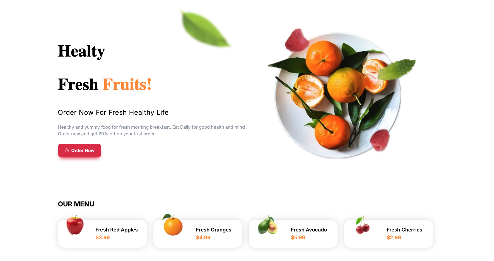
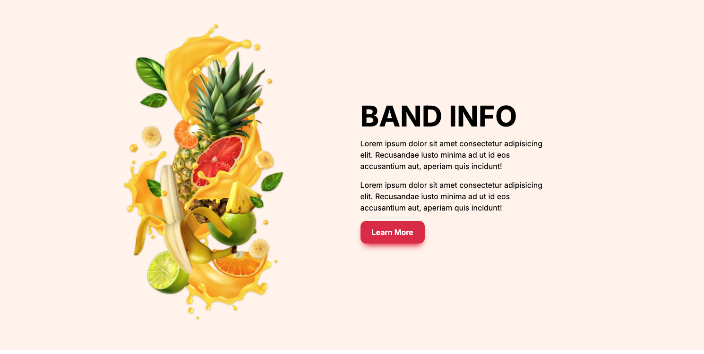
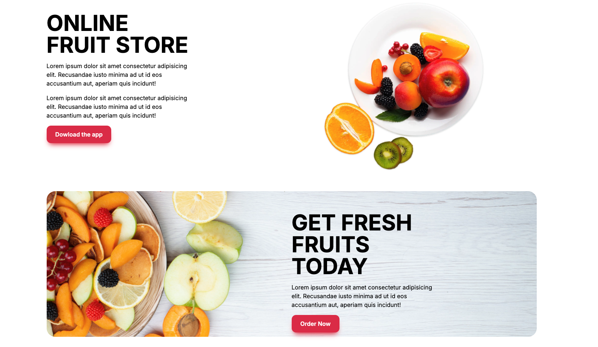

# 🍓 Fresh Fruits – Healthy Landing Page

A modern, responsive landing page built with **Next.js**, **Tailwind CSS**, and **Framer Motion**.  
Includes subtle animations, mobile-first design, and smooth scroll-based interactions.

---

## ✨ Features

- Responsive layout with Tailwind CSS
- Scroll-triggered animations using Framer Motion
- Simple and clean fruit-themed UI
- Component-based structure (Hero, Banner, Menu, Footer, etc.)

---

## 🖼️ Screenshots

### 📌 Homepage Hero Section


### 📌 Animated Banner


### 📌 Footer Section


> Görsellerin çalışması için `README.md` dosyası projenin kök dizinindeyken, `public/assets/` içindeki resim yolları doğru olmalı.

---

## 🚀 Getting Started

```bash
npm install
npm run dev